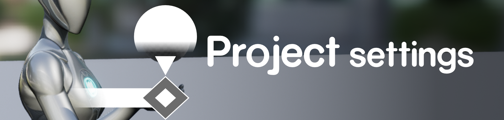
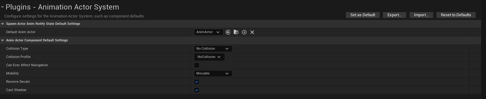

# Project Settings

The project specific settings for the animation actor system can be found in the "Animation Actor System" entry in the "Plugins" category of the project settings.

|  Spawn Actor Anim Notify State Default Settings|   |
|---|---|
| `Default Anim Actor`   |  The AnimActor to spawn when using the TimedSpawnActor NotifyState provided by the plugin. Allows to handle the provided date from the NotifyState in custom ways without needing to create new NotifyStates. Must inherit from AAnimActor.|

The following settings are used as they would be when setting up any mesh component in any actor. These will be applied to any component created by the default AnimActor spawned from notify states.
|  Anim Actor Component Default Settings |   |
|---|---|
| Collision Type | Collision Type to use. Can be NoCollision, QueryOnly, PhysicsOnly, or  CollisionEnabled.  |
| Collision Profile  | Collision Profile to use for newly created componets in the anim actor  |
| Can Ever Affect Navigation  | Should the navmesh be affected by the component?  |
| Mobility  | Component Mobilit to use. Can be Static, Stationary, or Movable. |
| Receive Decals  | Whether the meshcomponent should receive decals.  |
| Cast Shadows | Whether the meshcomponent should cast shadows.  |