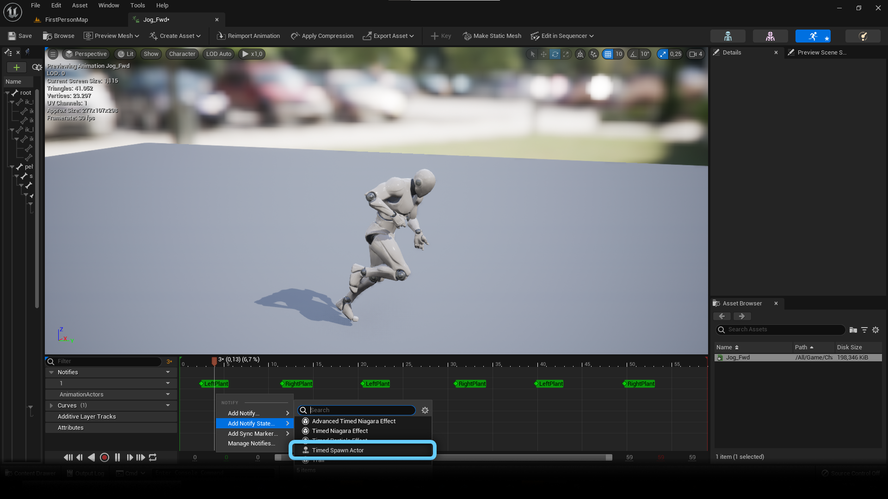

# QuickStart

## Welcome to the QuickStart of the Animation Actor System

To Get Started, you first need to enable the Plugin by going on Edit > Plugins.
There you should find it in the "Animation"-Category.

### Usage

Once the Plugin is enabled you can dive right into it. Open an Animation Sequence, Composite or Montage that you want to add some object into.

Once you have chosen and opened your asset, go ahead and add a "**Timed Spawn Actor**" AnimNotifyState. This should now show up with the Plugin enabled.

Now drag the start and end of the NotifyState to where you want the object to appear and disappear respectively.

To choose what object you want to spawn, look into the details panel:

If you have actors already created that you just want to use here, you can add them to the "**Actor Data**"

If there are no existing actors you want to spawn, you can also use the "**Construction Data**" to dynamically construct them.
Each Entry in the "**Construction Data**" represents a separate actor being spawned.
There you can set as many skeletal and/or static meshes as needed to create the actor from.

Either of the options allows you to attach the resulting actors to any bone of you want to, with or without an Offset.

And that's the basics!

For more information please refer to the **[Documentation](README.md)**

