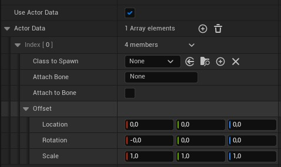

# Animation Actor System

The main functional unit in the **Animation Actor System** is the AnimNotifyState _TimedSpawnActor_(`UAnimNotifyState_SpawnAnimActor`).

This NotifyState is ready to use out of the box and should provide enough flexibility for most usecases.

If desired its baseclass `UAnimNotifyState_SpawnActorBase` can be extended with custom functionality like actor handling and custom component settings.

## TimedSpawnActor AnimNotifyState

### Actor Data

The `ActorData`-Property is used to assign a list of already existing actor classes.
For each entry in the list, a corresponding actor of the specified class will be spawned and attached as per specifications.

### Construction Data

The `ConstructionData`-Property is used to dynamically create actors(these will be of class `AAnimActor`) from a list of construction data
comprised of data that describes skeletal mesh components, data that describes static mesh components and their relationships.

While most of the settings should be self explaining as they are used in the same context as when the components are created by hand,
the main properties defining the relationships between the components are `AttachTo` and `AttachComponentIndex`.
As both skeletal and static data are arrays, the `AttachComponentIndex` refers to the index the corresponging component should be attached to.
Similarly `AttachTo` refers to which of the two data types the `AttachComponentIndex` refers.

Consider the follow setup:
We are setting up a static mesh component, setting `AttachTo` to skeletal, `AttachComponentIndex` to be 2, and the `AttachSocket` to "hand_l".
In that case the static mesh component we are setting up, will be attached to the socket "hand_l" on the component created by index 2 in the `SkeletalData` ist.

The Combination of a list of `SkeletalData` and a list of `StatiData` will be created in a single actor which can then be treated as such going forward.

Of course, just as with the `ActorData`, the `ConstructionData` can contain multiple actors with different setups, attachements, and offset-transforms.

## Extending `UAnimNotifyState_SpawnActorBase`

Extending the baseclass can be done both natively as well as in Blueprints.
In Blueprint this is done by implementing the event `BlueprintSpawnActors`.
Natively `virtual void SpawnActors(
USkeletalMeshComponent* MeshComp, TArray<AActor*>& SpawnedActors);` should be overriden.
Both have SpawnedActors as an output defined. Any actor that gets spawned should be added to that array, so it can be destroyed once the NotifyState Ends.

## AnimActor Destruction Interface

The System provides the Interface `IAnimActorDestructionInterface` to be implemented in any actor that you want to spawn via the `UAnimNotifyState_SpawnActorBase`.
This is optional, you can assign any actor when spawning, independent whether it implements the interface or not.

It contains the method `RequestDestruction` that allows the actor to return a bool when the notifystates requests to destroy it.
By default this will return `true` which tells the notifystate to to go on and destroy it, when the NotifyState ends.

**If `false` is returned the actor will not be automatically destroyed.** Then it is up to the actor/an external system to destroy it.

